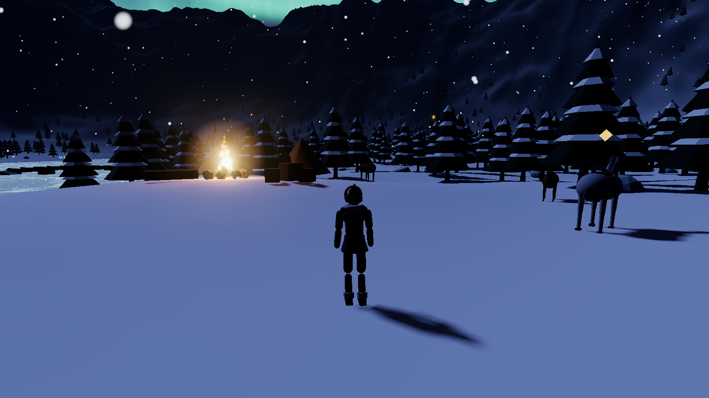
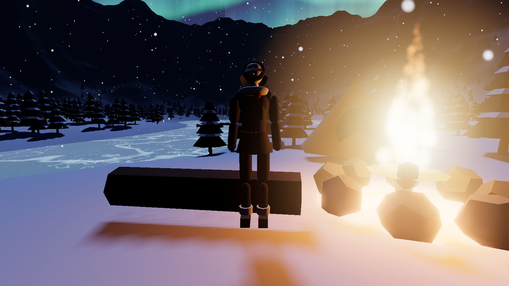
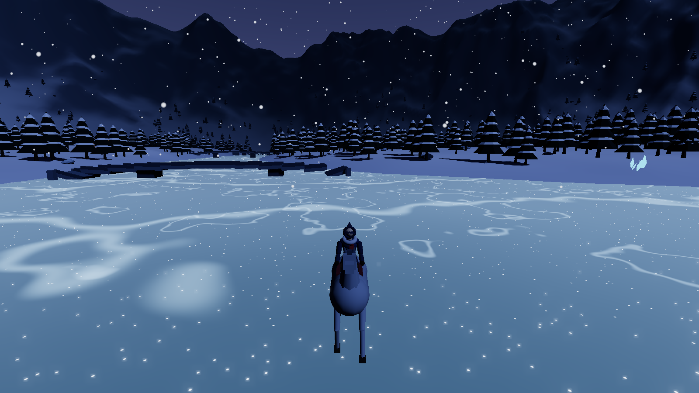
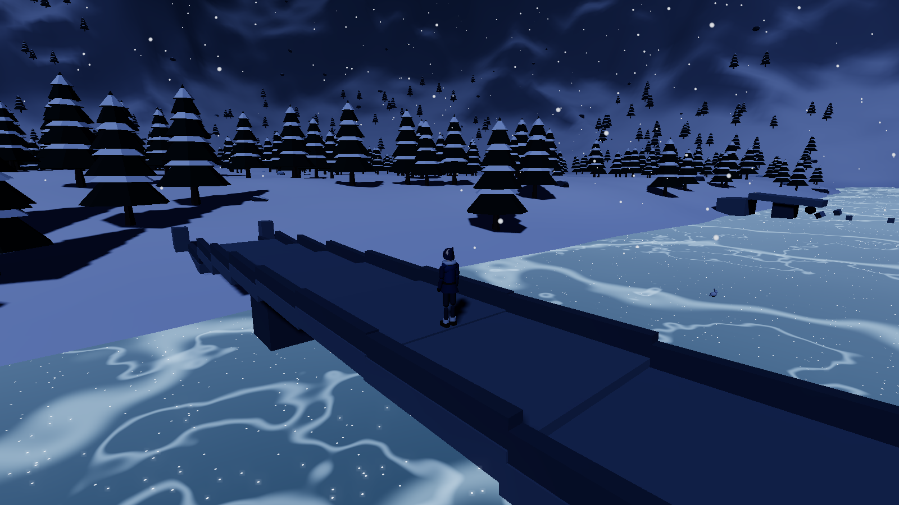

# Frostvale — The Veiled Vale ❄️

An original, fully procedural 3D fantasy zone you can explore **on foot or on
horseback**, right in your browser. A snowbound alpine valley at night: dense
frosted pine forest, a frozen river crossed by old stone bridges, a
mirror-still lake, jagged moonlit peaks, an aurora overhead, deer and snow
hares in the meadows, and the warm glow of a lone campfire.

Everything — terrain, forest, ruins, characters, animals, sky — is generated
in code. There are **no downloaded assets**, so the project is tiny, loads
instantly, and is 100 % original work.


*Last Ember Camp — the spawn point. The amber marker floats over a rideable horse.*


*The wanderer: an articulated, procedurally animated character.*


*Galloping across the frozen lake Mirrormere.*


*Wanderer's Crossing — one of two intact bridges you can ride straight over.*

## The zone

Frostvale is an invented place with its own landmarks (any resemblance to
zones from existing games is limited to the general "snowy night valley"
mood — no names, layouts, or lore are borrowed from anywhere):

| Landmark | What it is |
|---|---|
| **The Palewood** | Dense instanced pine forest filling the valley floor |
| **Palefrost Run** | A frozen river meandering north–south |
| **Mirrormere** | The frozen lake the river pools into, ringed by glowing ice crystals ("Starfall Shards") |
| **Skyshard Peaks** | The jagged mountain ring enclosing the vale |
| **Wanderer's Crossing** | An intact arched stone bridge near the camp — walk or ride across, or pass beneath it on the ice |
| **Northlight Bridge** | A second crossing on the way to Mirrormere |
| **The Sundered Span** | A collapsed bridge further south — scenery, not a shortcut |
| **The Hollow Gate** | A ruined vaulted gallery (a short tunnel) on the trail up to the tower |
| **Aldwyn's Watch** | A ruined watchtower on a hillock — someone keeps a lantern lit in the top window |
| **Last Ember Camp** | The spawn campsite: fire ring, tents, crates — and three saddled horses grazing nearby |

## Features

- **Articulated player character**: a hooded wanderer with natural human
  proportions and a full procedural animation set — idle (breathing, weight
  shift, glancing around), walk, run, jump with landing recovery, banking
  into turns, and a fluttering scarf. Winter outfit: fitted indigo coat with
  fur collar, belt with brass buckle, gloves, fur-cuffed boots.
- **Horseback riding** as a first-class feature: three named horses (Boreal,
  Ember, Vesper) graze by the camp under a floating amber marker. Press `E`
  nearby to mount; ride with momentum, a real turning radius, and a gallop;
  press `E` again to dismount. While mounted, the same articulated character
  sits in the saddle, leaning into the gallop.
- **Robust, layout-independent input**: every binding is tracked by both the
  physical key *code* and the produced *key value*, so `E` / `Shift` work on
  QWERTY, AZERTY, Dvorak, Thai, and other layouts alike. Arrow keys work as
  a WASD alternative.
- **Wildlife**: deer graze the forest meadows (they trot off if you get
  close, and bolt from a galloping horse) and snow hares hop through the
  brush — all with a small wander/flee AI and terrain-following.
- **Crossable bridges**: two intact stone arches span the frozen river.
  Their decks are part of the ground model, so you can walk/ride over them
  *and* pass underneath on the ice.
- **Procedural terrain** from an analytic height function — valley, river
  bed, lake basin, mountain ring; characters follow the terrain exactly with
  no raycasts.
- **~2 400 pine trees in a single draw call** (merged geometry + instancing),
  swaying in the wind via a GPU vertex-shader patch.
- **Frozen water shader**: depth mottling, crack veins, fresnel sheen, fake
  moon specular, and twinkling frost glints.
- **Night atmosphere**: moonlight with dynamic shadows, exponential fog,
  gradient sky dome, twinkling stars, moon + halo, and an animated **aurora**.
- **GPU snowfall** (4 000 flakes wrapped around the camera), ground frost
  glints, flickering campfire with particle flames, tower lantern.
- **Footprints and hoofprints** stamped into the snow, fading as fresh snow
  buries them.
- **Bloom post-processing** so fire, crystals, aurora and sparkles glow.
- Collision against tree trunks and ruin walls, plus slope limits so you
  can't sprint up a cliff face.

## Controls

### On foot
| Key | Action |
|---|---|
| `W A S D` (or arrow keys) | Move |
| Mouse | Look around |
| `Shift` | Sprint |
| `Space` | Jump |
| `E` | Mount a nearby horse (a prompt appears when close enough) |
| `Esc` | Release the mouse (click to re-enter) |

### Mounted
| Key | Action |
|---|---|
| `W` | Ride forward (builds speed gradually) |
| `S` | Slow down / halt, then back up |
| `A` / `D` | Steer — the turning arc widens with speed |
| `Shift` | Gallop |
| `E` | Dismount |

## Requirements

- [Node.js](https://nodejs.org/) 18 or newer (Node 20+ recommended)
- A browser with WebGL 2 (any recent Chrome, Firefox, Edge, or Safari)
- A discrete or integrated GPU from the last ~8 years is plenty

## Run it

```bash
git clone git@github.com:pengpersonalthai-jpg/frostvale-3d.git
cd frostvale-3d
npm install
npm run dev
```

Open the printed URL (usually `http://localhost:5173`), click once to grab
the mouse — you spawn facing the horses.

### Production build

```bash
npm run build     # outputs a static site into dist/
npm run preview   # serves the built site locally
```

The build uses relative paths (`base: './'`), so `dist/` can be dropped onto
any static host — including GitHub Pages — without configuration.

## Project structure

```text
frostvale-3d/
  index.html            UI overlay (title screen, HUD, prompts) + entry
  vite.config.js
  src/
    main.js             Bootstrap: renderer, lights, world, frame loop
    ui.js               DOM HUD helper
    world/
      noise.js          Seeded value noise + fBm (deterministic)
      terrain.js        Height function, bridges' deck model, terrain mesh
      forest.js         Instanced pines, GPU wind sway, collision grid
      scatter.js        Instanced boulders, bushes, glowing crystals
      animals.js        Deer + snow hares: models and wander/flee AI
      ice.js            Frozen river/lake shader
      sky.js            Sky dome, stars, moon, aurora
      ruins.js          Tower, bridges, Hollow Gate, campsite (+ colliders)
    controls/
      input.js          Action-mapped keyboard + pointer-lock mouse
      camera.js         Third-person spring-arm follow camera
      character.js      Articulated wanderer + animation set   ← character
      player.js         On-foot movement, jumping, footprints
    mount/
      horse.js          Procedural horse model + gait animator  ← core
      riding.js         Mount system: interact, riding physics  ← core
    effects/
      snow.js           GPU snowfall + ground glints
      fire.js           Flickering fire light, flame particles, glow
      footprints.js     Instanced fading print decals
      postfx.js         Bloom composer
  docs/                 Screenshots
```

## How the horse system works

The two files to read are `src/mount/horse.js` and `src/mount/riding.js`
(the character shared by both modes lives in `src/controls/character.js`).

- **The model** is assembled from primitives (capsule barrel, jointed
  cylinder legs, boxy head) with every joint as a `THREE.Group` pivot.
- **The animation is procedural**, not skeletal: phase-offset sine waves
  drive the leg pivots — diagonal pairs for the trot, front/back grouping
  with body bounce and a stretched neck for the gallop. Idle horses breathe,
  swish their tails and periodically dip their heads to graze. The deer
  reuse exactly this animator.
  *Trade-off:* a rigged GLTF with authored clips would look smoother up
  close, but procedural gaits keep the repo asset-free, weightless, and easy
  to tweak; at gameplay camera distance they read convincingly.
- **Riding physics** live in `MountSystem.update()`: speed integrates
  acceleration (7.5 u/s²) toward walk/gallop targets with a stronger brake,
  and the steering rate shrinks as speed grows — so a gallop turns in a wide
  arc while a standing horse can pivot. The horse follows terrain (and
  bridge decks) smoothly and pitches to match the slope. While mounted, an
  instance of the articulated character is posed astride the saddle, and
  the camera eases to a taller, further profile with a small FOV kick at
  gallop speed.

## Performance notes

- Trees, rocks, bushes, crystals and prints are **instanced** — the whole
  forest is one draw call.
- Snowfall and tree sway run **entirely on the GPU**; per-frame CPU work is
  two uniform updates.
- Terrain height queries are **analytic** (no raycasting against meshes);
  bridge decks are two closed-form arch functions checked on top.
- The moon's shadow camera is a tight 140 m box that follows the player,
  instead of one blurry frustum over the whole valley.
- Pixel ratio is capped at 2 and the far fog lets the GPU cull almost
  everything beyond ~400 m.
- Wildlife is intentionally sparse (11 animals) and uses plain meshes;
  the AI is a few distance checks per animal per frame.

## Troubleshooting

- **Black screen / "WebGL not supported"** — enable hardware acceleration in
  your browser settings; the world needs a working GPU context.
- **Mouse won't lock** — browsers require a user gesture: click the title
  overlay once. If you press `Esc`, click again to re-capture.
- **Keys seem dead** — make sure the mouse is captured (click once); the
  game pauses whenever the pointer is released. All bindings accept both
  physical key position and typed character, so alternative layouts work.
- **Low FPS** — shrink the window or lower your display scaling (the biggest
  cost is fill rate + bloom at high resolutions). Integrated GPUs run best
  around 1080p.
- **`npm run dev` fails** — check `node --version` (needs 18+), delete
  `node_modules` and re-run `npm install`.
- **Port already in use** — `npm run dev -- --port 3000`.

## Pushing to GitHub

```bash
git init -b main
git add -A
git commit -m "Frostvale: snowy 3D zone with horseback riding"
git remote add origin git@github.com:<you>/frostvale-3d.git
git push -u origin main
```

## Implemented vs. future ideas

Implemented: everything in the feature list above.

Ideas for later:

- Gamepad support and a first-person camera toggle
- Snow-kick particles at the hooves during a gallop
- Ambient audio (wind, fire crackle, hoofbeats on ice vs. snow)
- A day/night or weather cycle (blizzard rolling in over the peaks)
- Distant-tree billboard LOD to push the forest density even higher
- Wolves on the tree line whose eyes catch the lantern light…

## Assets & license

- **No external assets.** Every mesh, texture and effect is generated in
  code at startup (the only "texture" is a radial-gradient canvas drawn for
  the fire glow).
- Code is released under the [MIT License](LICENSE).
- Frostvale, its landmarks and lore are original inventions for this
  project; no names, maps or content from any game are used.
